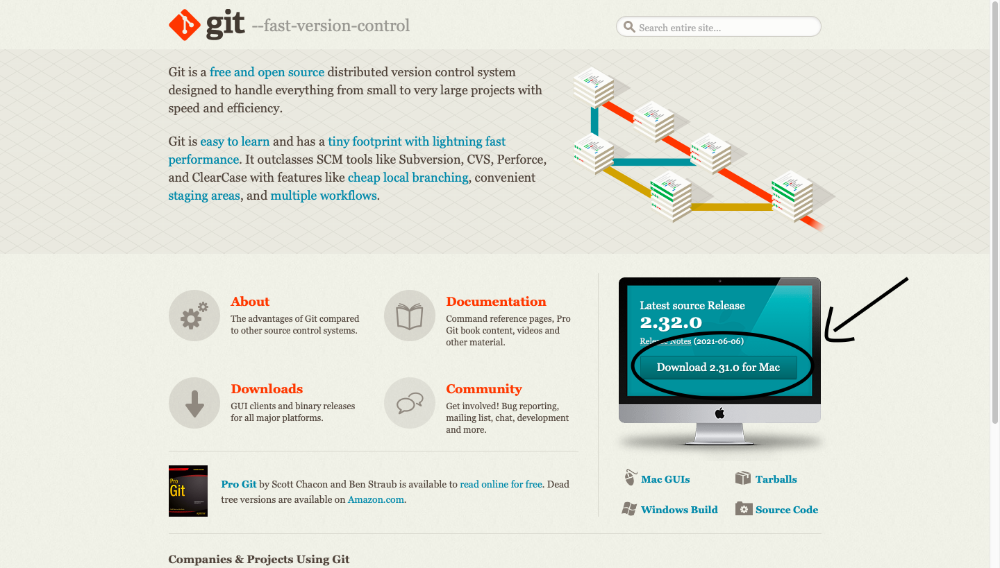
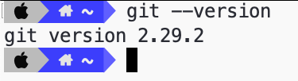
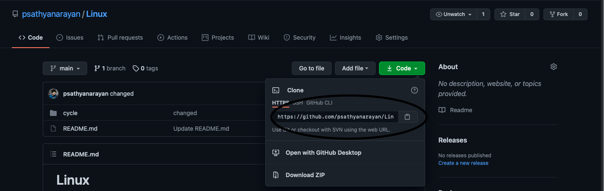
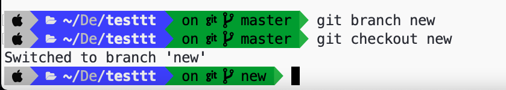
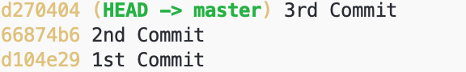
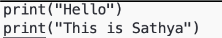

# Git_Session
<h1 align="center">Hello, folks!, I'm <a href="#">P Sathya Narayan</a>  </h1>

## This Repository contains assignemnts and resources of the session Introduction to GIT
<p align="center">
<a  href="#"></a></p>

## How to Install Git
- Go to https://git-scm.com


- After Successfully installing with all Recommended Settings 
- Open your CMD/Terminal
- Type
```
git --version
```



- Configure your Git
```
git config ––global user.name “your github_username”
git config ––global user.email “email_address”
```

- Now Create a Repository in your Github
- Copy the repo url


- Now there are two ways
  - One by cloning this repo
  
```
git init
git commit -m "first commit"
git branch -M main
git remote add origin https://github.com/psathyanarayan/testtt.git
git push -u origin main 
```
  - Or by coding then pushing to this repo
  
```
git remote add origin https://github.com/psathyanarayan/testtt.git
git branch -M main
git push -u origin main
```
## Creating and changing Branches

- This creates and changes to the new branch new
```
git branch new
git checkout new
```


## Version Control
- I commited 3 chnages to my file
```
git log --oneline 
```
#### Shows all my commit with their SHA1



- If I need to know what is in the 2nd commit of  Hello.py 
```
 git show 66874b6:Hello.py
```
#### Where 66874b6 is the shown SHA key when we perform the above step


- If I need to revert to this change then
```
git checkout 66874b6 Hello.py
```
#### Then normally commit
